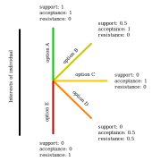
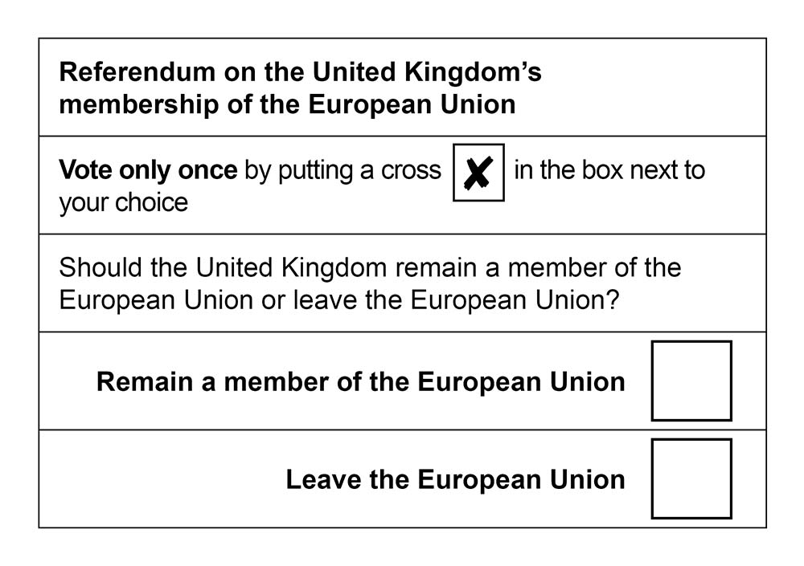

# Scalable, cooperative decision-making

_Doug Webb, 2017, [@DougInAMug](https://twitter.com/DougInAMug)_

Pyramids and smartphones clearly demonstrate what coordinated action at a massive scale can achieve. However coordinating through hierarchies and markets, as in the case of these examples, leads to personal relationships based on coercion and competition. 

Relationships based on cooperation can be formed by coordinating through collectives such as groups or federations. Presently however, these patterns fail to coordinate action at the scale required for the likes of pyramids or smartphones.

_How can action be coordinated in a scalable, cooperative manner?_ Whilst there is merit in taming hierarchies and markets to be more cooperative, this text primarily considers how collectives can cooperate at scale by focussing on the fundamental coordination process: decision-making.

<<< Firstly, what is meant by decision-making that is cooperative and scalable is explored and defined. Secondly, the major decision-making approaches of majority-rule and unanimous-consent are evaluated regarding cooperativeness and scalability. Thirdly, decision-making elements that could be incorporated into different formats are put forward independently then together in an example. Finally, further considerations for decision-making and coordination in general are discussed. >>>

## Definitions
**Decision-making <<< Consider this section and maj/unanim later >>>**

Decision-making is reducing a set of possible options to probable actions, the eliminative nature of the act being reflected in the origin of 'decision' from latin _decidere_ meaning 'to cut off'. It can be challenging enough for a single person with one set of opinions to come to their own decisions, collective decision-making faces the challenge of converting multiple sets of opinions into a single decision. The main variables in the making a collective decision are 1) the available options 2) how individuals can express their opinions and 3) how opinions are combined and compared. 

Decision-making occurs when there is a will for change. Perhaps the current state of affairs (status quo) is actively problematic or there is simply a desire for improvement. Whatever the reason there must be a viable alternative or proposal since a decision requires at least two options. Forming proposals, whilst intimately linked to decision-making, is a distinctly creative process and a lesser concern for coordination.

## Cooperation
In this text cooperation refers to a quality of interaction between individuals, which can be poetically described as "the art of pursuing the object of their common desires in common". Some effort will be taken to specify exactly what is meant by cooperation to distinguish it from a vague notion of good-will or conflict-free collaboration.

The first aspect of cooperation is taken to be *autonomy*. Autonomous individuals chose how to pursue their interests and whether to associate or dissociate with others in order to do so. Coercion, such as threat or force, inhibits an individual from pursuing their true interests and thus prevents them being autonomous: whilst a coerced individual might be said to be compliant, they cannot be said to be cooperative.

The second aspect of cooperation is taken to be *equality*. Clearly people are different in countless ways and equality cannot mean general symmetry. Instead equality is specific to that which can be valued equally, in particular, the interests of individuals. Two individuals that value the interests of the other the same as their own interact to pursue the sum of their interests, their _collective-interest_. Cooperation means the pursuit of the collective-interest even when an individual could profit at the collective expense, as illustrated scenario in the Prisonner's Dilemma. 

The Prisonner's Dilemma is a scenario in which two autonomous individuals cannot communicate and receive reward-units individually based on whether they 'cooperate' or 'defect', as outlined in Figure 1. It is in the collective-interest of *A* and _B_ to cooperate and receive six units, three each. However, if *A* or _B_ only considers themself, it is in their interest to defect since they receive five units if the other cooperates (instead of three) or one unit if the other also defects (instead of none). Mutual defection, where competition of 'rational' individuals leads to the worst collective outcome is often described as _the tragedy of the commons_.

_Figure 1. The Prisonners Dilemma viewed individually (left) and collectively (right)_

(acceptability. not units, opinions. opinion is two fold. better avoid resistance than gain support. extreme position: pinprick. not infinitely better if autonomous.)

The final aspect of cooperation is taken to be *acceptability*. In most scenarios the value of an outcome to individuals not measurable in abstract reward-units and the collective-interest can only be identified by the direct communication and combination of individual opinion.

The opinion of an individual towards an option is not, fundamentally, a preference relative to the other options, but a measure of positive or negative alignment between the option and their interests. Positive alignment, _support_, indicates a willingness to contribute to the realisation of the option and to engage with the collective. Negative alignment, _resistance_, indicates a willingness to prevent the realisation of the option and to separate from the collective. Acceptability, the preference for non-resistance or _acceptance_ over support. 

p is can be seen to be desirable if support is taken to indicate a state of 'happiness' and resistance a state of 'suffering' as articulated by Karl Popper:

> “there is, from the ethical point of view, no symmetry between suffering and happiness, or between pain and pleasure… human suffering makes a direct moral appeal, namely, the appeal for help, while there is no similar call to increase the happiness of a man who is doing well anyway.”

This position he extreme position, that it is preferable to select an outcome with no suffering and negligible happiness to one that brings minuscule suffering and vast happiness, is described as 'the pinprick argument'. This can be viewed as a slippery slope argument where minuscule suffering for vast happiness should not allowed in case things descend to the allow significant suffering for only mildly greater happiness.

However, in the case of autonomous individuals the reduction of resistance is not infinitely more preferable than the pursuit of support since suffering is bounded: If no individual is forced to endure anything, not even a pinprick, then resistance is willfully endured up to the point where an individual can better serve their interests by dissociating from the collective. 

In making decisions people express their opinions towards possible outcomes. As such, 'resistance' is used to indicate an outcome going towards towards an individuals interests, 'support' is used to indicate an outcome away from an individuals interests and 'acceptance' is used to indicate the absence of resistance or support. In these terms, cooperation is when support is preferable to acceptance and acceptance is much more preferable than resistance: the cooperative outcome is the one where Resistance << Acceptance < Support.

	

## Scalability
A process that continues to function with an increase in quantity is said to be scalable. Cooperative decision-making is scalable if it selects the cooperative decision as a collective grows.

A collective grows when the rate of individuals associating exceeds the rate of individuals leaving. The main reason for a self-determined individual to associate and remain associated is that doing so helps them more effectively fulfill their interests. If collective effectiveness is considered to be the likelihood of decisions being fulfilled then support is can be taken as a positive indicator whilst resistance is a strongly negative indicator, implying conflict or dissociation. Hence the general condition for growth is cooperation, the ability to act such that Resistance << Acceptance < Support.

How a collective is able to make cooperative decisions depends on its current size. Often starting very small, with roughly 10 individuals, it is possible for all individuals to create strong social connections and a common mental model. In meetings it is possible for all to attend and fully express themselves. Because of these phenomena it is possible for small-scale collectives to coordinate and make decisions informally. Certain collectives intentionally limit themselves to small-scale precisely to utilize these benefits, including activist 'affinity groups' and software development 'scrum teams'.

<!--  -->

As a collective gets bigger the ability for mutual understanding rapidly decreases due to restrictions in time, space and cognitive capacity. A collective of 100 individuals is capable of forming significant mutual understanding and occasionally meeting together. At this point decisions must be made formally using clear, unambiguous and widely understood process. It can be troubling for small groups with an aversion to accept formality, but failure to do so often results in dissociation of informal coercion.

At sufficiently large scale, say 10,000 +, the majority of individuals will probably never meet. Whilst mutual understanding will always be shared in overlapping locales, making decisions on a global level must be both formal and decentralized.

## Current approaches
Collectives already make decisions, the two most common approaches being majority-rule and unanimous-consent. These approaches are compared with the definitions of cooperation and scalability outlined previously.

### Majority-rule
Majority-rule selects the option most favored by most people. This can be seen as an interpretation of equality where since each opinion is of equal value, the majority opinion is the most important. The majority-rule approach is commonly used for binary decisions where individuals vote _for_ or _against_ a proposal with a majority _for_ leading to its adoption and a majority _against_ leading to its rejection.

Firstly an individual could have resistance towards the specific change outlined in the proposal and towards no change at all (status quo) and thus be forced to chose the 'lesser-of-two-evils' when acceptable alternatives exist. Further, since an individual is only able to express their favored option they cannot express resistance or support and the identification of the option where R << A < S becomes impossible. For example, consider the case where a collective can adopt a proposal (A) or maintain the status quo (B),

* 51 % somewhat support A and strongly support B
* 49 % strongly support A and strongly resist B

Decided with majority-rule, B would be selected even though it is strongly resisted by almost half of voters whilst A is globally supported. This outcome has significant potential for conflict thus a reduced likelihood of implementation (group effectiveness) and thus an increased likelihood of dissociation. Majority-rule is neither cooperative nor scalable.

### Unanimous-consent
Unanimous-consent seeks to find an option acceptable to all. This can also be seen as an interpretation of equality where since each individual is equal no one should have to endure an outcome they resist. This approach is commonly seen in deliberative assemblies where creative and eliminative processes are iterated to amend a proposal until no resistance remains. If resistance remains after some period individuals vote to _support_, _accept_ or _veto_ the proposal as it stands with no _vetos_ leading to its adoption and one or more _vetos_ leading to its rejection.

Firstly individuals are not given the option to make no changes even though this is often a widely acceptable option. Secondly the ability to _veto_ overrules any amount of support and again, the identification of the option where R << A < S becomes impossible. Consider the case where after a several amendments a collective can adopt a proposal as it stands (X) or amend it further (Y)

* 1 person very strongly resists X and somewhat supports Y
* countless others strongly support X and strongly resist Y

Decided with unanimous-consent, Y is selected even though it is strongly resisted by almost all of the voters whilst X is supported by almost all voters. The ability to veto whilst claimed to prevent minority-overruling can lead to minority-rule, avoidance of conflict, groupthink, pluralistic ignorance, belligerance, 'watered-down' decisions, etc. Unanimous-consent is neither cooperative nor scalable. 

## Elements
### Options
In decision-making where a single proposal <<< commonly in maj and unanim >>> is available there is the appearance of an active option to adopt the proposal and a passive option to not adopt the proposal. However, not adopting a proposal keeps things the way they are which can be reframed actively as maintaining the status quo. In framing the status quo passively against active proposal a conceptual divide is created perhaps to the point of cognitive bias. Presenting the status quo equally alongside proposals removes this conceptual divide and allows individuals to more accurately express their opinions.

Worse than being framed passively is not including the status quo option at all. If a collective gets to the point of actually making a decision then there is clearly some will to change from the status quo. However, the status quo option has the unique property among options of being directly experiential and the outcomes of choosing it being highly predictable. Not including the status quo option forces individuals away from the outcome they can be most sure of and into change. The status quo is often the most cooperative outcome and should be included on that basis.

Following on from the previous element, a scenario can be imagined where an individual is presented with two options: a proposal which represents a particular change and the status quo which represents no change. With only these options available, an individual who wants change but not the particular change outlined in the proposal cannot express it. A decision made in this case could easily mask resistance.

Whilst a collective is constrained by from trying all possible options due to finite resources, the number of possible options is infinite and the one leading to the most cooperative decision may be among them. As an option this is often negatively formulated as 'none of the above' but it s not clear whether this indicates the will to find other options or abstention. Formulating it positively as 'find other options' unambiguously reveals the stance as active.

Precisely what FOO would entail depends on the situation and corresponding format and would best be predetermined: for small groups it could be a return to discussion, for a large group it could be postponing the decision til next meeting and for a huge network it could be a re-scheduling of the decision with a process of exploration, short-listing...

Including FOO ensure that everyone has an acceptable, positive option. Whilst there options could be actively proposed each time, having them as a formal inclusion is pragmatic and provides a psychological safety net.
	
### Expressions
In order to find the most cooperative solution, the one where resistance << acceptance < support, individuals must be able to fully express their opinions. The formal expression of opinion is called voting regardless of whether the format is hand signals or written paper, from Latin _votum_ "a vow".

Voting by expressing a single, favorite option, as discussed in the examples of majority-rule and unanimous-consent, is called plurality voting. Plurality voting prevents the expression of polarity and magnitude of opinion for the selected outcome and conceals all opinion of the remaining options. The inability to express resistance and support completely obscures the cooperative solution.  

Voting by ranking multiple options to reflect order of preference is called ranked voting. This does allow greater understanding of preference, it still deprives prevents the expression of polarity and magnitude of opinion. For example, in the case of polarity, it is not known at what rank an individual moves from support to resistance; in the case of magnitude, the finishing times in a race between 1st and 2nd place and 2nd and 3rd place could be completely different. Again, the inability to express resistance and support completely obscures the cooperative solution. 

The only way of voting that always allows individuals to express their honest opinions with polarity and magnitude is by giving independent scores. Score voting (a.k.a rating) at its most basic is the expression on each option from three values which is the minimum required to indicate polarity: active support, active resistance and absence of either, acceptance. In order to express magnitude of resistance or support, more than three values are needed with five or seven values being an alright idea. Much above eleven points and people likely to break it down into smaller denominations. Also important to explicitly describe values so people know how to express themselves: pictorally, verbally and numerically.

### Rules
Score voting normally values scores as equal increments and chooses the option the highest total score. For example, in a situation where there are three ways to score ('Resist, accept, support') the score values would be -1, 0 and +1. However, on the basis that scoring represents resistance and support, using this equal weighting treats resistance as 'negative support' and selects the option where R < A < S.

The simplest way to select the option where R << A < S is to weight resistance scores more heavily than support scores. Using a weighting factor of 2 would value non-resistance twice as favorably as support. It might be tempting to increase thie weighting factor to something in an attempt to avoid resistance however do so has consequences. If a weighting factor approaches the point where resistance from one individual outweighs all potential support in the group, the voting system degenerates such that only resistance scores carry decision-making value. This potentially denies a supermajority of individuals from pursuing their interests and forces them to vote dishonestly (only in terms of resistance), become more exclusive/exclusionary or leave. So the weighting factor must be greater than 1 and significantly less than the number of individuals. In smaller groups the weighting factor is likely to be higher and in larger groups it is likely to be lower.

## General form
The 5 elements discussed above if taken together can be summarised into the following general form:

1. Ballot: Include 'status quo' and 'find other option' alongside proposals.
2. Voting: Score options in a way that differentiates support from resistance.
3. Decision-rule: Select option with highest R << A < S by weighting scores.

## Specific format
To outline a specific format for this general form, imagine a large group (>50) that meets once a month to make decisions. Proposals are developed by individuals and small groups between meetings then presented during meetings. Due to shared vales, unanimous consent for proposal is sought first using a semi-formal, deliberative process. In the case that unanimous consent is deemed unfeasible (e.g. time restrictions, fundamental impasses, etc.) individuals have some way to trigger a formal, decisive process. 

1. Ballot: The proposal(s) outlining changes to the current state of affairs, the following options are also included:
	* Status quo: change nothing and maintain the current state of affairs.
	* NOTA: postpone the decision til the next meeting, forming different proposals in the meantime.
2. Voting: You will have the opportunity to formally express your opinion on each option after it is read in one of three ways: 
	* Resist (-3): you have active resistance towards the option, show with arm-cross <!--PersonGesturingNO-->
	* Accept (0): you have no significant resistance nor support towards the option, show palms together  <!--FoldedHands-->
	* Support (+1): you have active support towards the option, show with raised hands <!--RaisingHands-->
3. Decision-rule: Votes will be tallied for each option and summed given the bracketed values above. The option with the highest sum total will be selected.

## Discussion
Cooperative decision-making can only really survive in a cooperative environment and how that is constructed remains to be seen. One compelling version is a federation of nested collectives. How do important decisions get escalated, especially to the global level? Too many global decisions could lead to fatigue and too few to frustration. How are proposals short-listed for ultimate decision? Too many leads to fatigue and too few to one of the control options. The answer to many of these question undoubtably rests in the creation and use of appropriate web-based or wireless software (free, encrypted and open-source, naturally).

